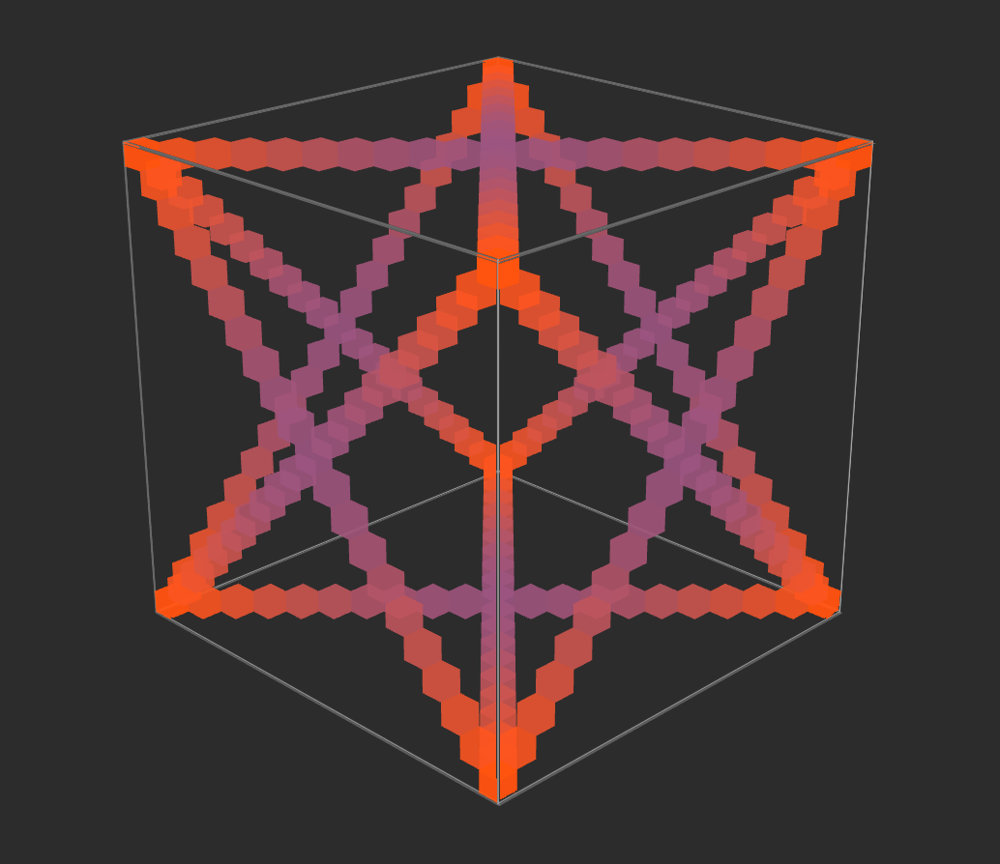
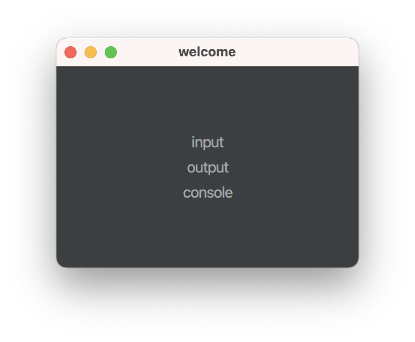
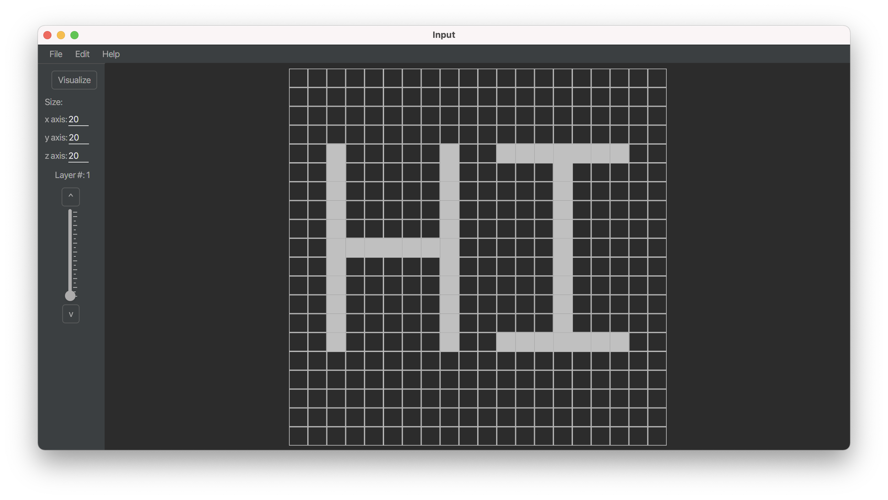
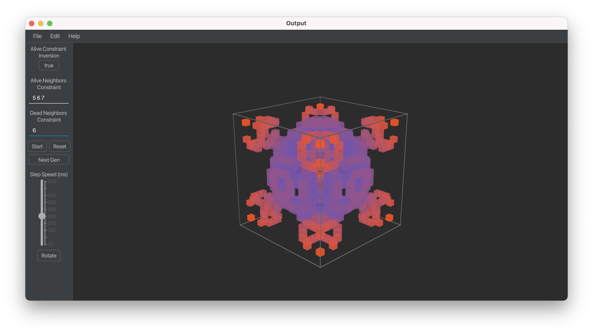
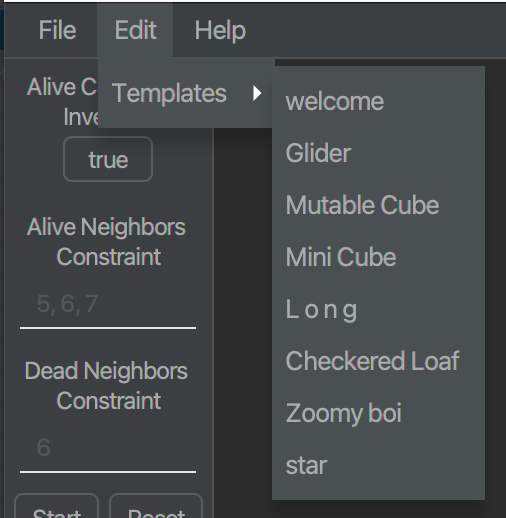
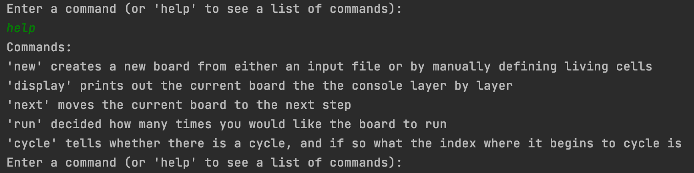

# Welcome to Game of Life 3D!
>


Inspired by [Conways Game of Life](https://en.wikipedia.org/wiki/Conway%27s_Game_of_Life), this program provides a easy and streamlined
method of input and output for 3D Cellular Automata. The default rules are 5 6 7 for alive,
and 6 for dead. The cellular neighborhood we use to calculate alive and dead cells is moore's type.
With moore's neighborhood, 26 possible values are read in, and a/d cells are accounted for.


This project incorporates javafx, so to get started, the user's IDE will have to be set up to allow for this.

**Let's get started!**

# Installing javafx
First, begin by downloading  [JavaFX](https://gluonhq.com/products/javafx/).

Then, once have installed JavaFX is installed, watch the following video regarding 
the steps that you need to take to set up your ide for JavaFX.

* [Intellij](https://www.youtube.com/watch?v=BHj6zbH3inI)
* [Eclipse](https://www.youtube.com/watch?v=bC4XB6JAaoU)

# Running the Program
Now that your IDE is set up and ready to go, running the program is a breeze.

Once you pulled a copy of this repository and have it open in your IDE,
find ```main.java``` and run it. The user will be met with this screen:

>
The user can choose to go to: 
* *input*: to create a template, 
* *output*: if they desire to open a premade template, or a user-created template, or
* *console*: to access a premade file and view it in terminal

After this point, everything is self-explanatory. 

Let's keep going.

# Features
## Input 
>

This is where the fun begins. In this layout, the user can create their own custom template to later visualize in 3D. We added this feature to our program after realizing the difficulty of creating a template without a dedicated GUI. This GUI provides ease of creation, along with an appealing *dark-mode stylesheet*. This GUI has many underlying features including but not limited to:

* Streamlined layer-by-layer template creation:
  *  Custom size cube
  *  Paint feature
  *  Erase feature
  *  Clear all layers: ```Edit -> Clear all layers```
  *  Show center axes: ```Edit -> Show Axes```

* Saving/Opening user-created templates
  * Save: ```File -> Save Template```
  * Open: ```File -> Open Template```

Once the user decides to open or close a template, or create their own, they can then visualize it in 3D.

### Keybinds
* Move Up Layer: ```w```
* Move Down Layer: ```s```
* Fill layer: ```Ctrl + f```
* Clear layer: ```Crtl + c```
* Paint: ```Alt + MouseHover```
* Erase: ```Ctrl + MouseHover```

## Output
>

This GUI is where all the visualization happens. The board that is visualized can come from multiple different sources:
- a user-created template,
- [a pre-made template](./README.md#templates),
- or a saved file.
-----

Once the board is initialized, all of the features (as follows) can then be utilized:
* Custom rules for [Alive/Dead Neighbor Constraints](#-digging-deeper)
  * The default rules for this program are ```5, 6, 7``` for live neighbor constraints, and ```6``` for dead neighbor constraints.
  * These rules can be changed by the user, to allow for experimentation, or left as default.
* *Run*: begins the evolution of the model.
* *Next Generation*: executes a single step of the model.
* *Rotate*: Rotates the model whilst playing/paused for better visualization.
* *Step-Speed*: Change the speed of the evolution.
* *Reset*: Resets the model to the original state.


* Opening and Closing a File:
  * Open a file: ```File -> Open template```
  * Save original/current generation: ```File -> Save Generation```
### Templates
>
This program features a number of different templates, including but not limited to:
* [Welcome](https://imgur.com/a/8Ueq9px)
* [Star](https://imgur.com/a/cexPAoS)
* [Checkered Loaf](https://imgur.com/a/sz0bwvQ)
* [Mini Cube](https://imgur.com/a/dWu7Pdy)

## Console
>

# Digging deeper
## Alive/Dead Neighbor Constraints
This constraint in *3d game of life* builds directly off of the rules in [Conways Game of Life](https://en.wikipedia.org/wiki/Conway%27s_Game_of_Life). 
> Any live cell with two or three live neighbours survives.
> 
> Any dead cell with three live neighbours becomes a live cell.
> 
> All other live cells die in the next generation. Similarly, all other dead cells stay dead.

The concept is very similar for our version of *Game of Life*. In a 3D model, instead of having 8 possible neighbors, each cell has 26 possible neighobors. This means that our rules have to be adjusted accordingly, as follows:
* Any live cell with five, six, or seven live neighbours survives.

* Any dead cell with six live neighbours becomes a live cell.

* All other live cells die in the next generation. Similarly, all other dead cells stay dead.

## trueFirst Constraint
This constraint does not exist in the original *Game of Life* but has been added as an extra feature to our version. 

This constraint inverts the effects of the live neighbor constraint, such that when this is true (by default), the rules are as previously stated, but when this is false, the rules are inverted, shown as follows (changes in bold):
* Any live cell with five, six, or seven live neighbours **dies**.
 
* Any dead cell with six live neighbours becomes a live cell.
 
* All other live cells **survive** in the next generation. Similarly, all other dead cells stay dead.

